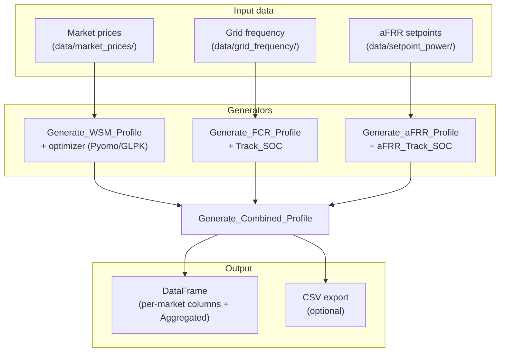

# Load Profile Generator (BESS)

Generate combined time-series power profiles for battery energy storage systems (BESS) participating in multiple grid markets:

- **Wholesale arbitrage** — day-ahead, intraday, and intraday-continuous optimization (Pyomo + GLPK)
- **FCR** — frequency containment reserve from grid frequency data
- **aFRR** — automatic frequency restoration reserve from balancing setpoints

## How it works



Each generator produces a **1-second power time series** (kW). The combined profile stacks the enabled services into a single `Aggregated` column suitable for battery simulation or export.

## Quick start

```bash
pip install -r requirements.txt
```

Install [GLPK for Windows](https://sourceforge.net/projects/winglpk/) (prebuilt `glpsol.exe`) or use `conda install -c conda-forge glpk`. Point `Solver_Path` at your `glpsol.exe` — required only when wholesale markets are enabled (`DA_Cap`, `ID_Cap`, or `IDc_Cap` > 0).

Input data for all supported countries is under `data/` (see [data/README.md](data/README.md)).

Open [demo.ipynb](demo.ipynb) or call the API directly:

```python
from Generate_Combined_Profile import Generate_Combined_Profile

profile = Generate_Combined_Profile(
    Country="GER",
    Year=2023,
    Sim_StartDay_index=3,
    Sim_EndDay_index=7,
    BESS_cap=30,
    power_cap=30,
    init_SOC=50,
    target_SOC=50,
    upper_SOC_limit=80,
    lower_SOC_limit=20,
    FCR_Cap=10,
    Pos_aFRR_Cap=10,
    Neg_aFRR_Cap=10,
    DA_Cap=10,
    DA_Cycles=1,
    ID_Cap=0,
    IDc_Cap=0,
    Solver_Path=r"C:\Dev\winglpk-4.65\glpk-4.65\w64\glpsol.exe",
    export_csv="output/combined_profile.csv",
    export_column="Aggregated",
)

profile.head()
```

## Parameters

All parameters are passed to `Generate_Combined_Profile()`.

### Location and time range

| Parameter | Required | Default | Description |
|-----------|----------|---------|-------------|
| `Country` | yes | — | Market country code: `GER`, `GB`, `AT`, `FR`, `IT`, `SP`, `US` |
| `Region` | US only | — | ISO market: `ERCOT` or `CAISO` |
| `Zone` | US only | auto | Load zone within the ISO (e.g. `HOUSTON`, `VEA`). Defaults to `HOUSTON` (ERCOT) or `VEA` (CAISO) |
| `Year` | no | `2024` | Calendar year of the input data (must match columns in Excel / `.mat` files) |
| `Sim_StartDay_index` | no | `1` | First day of simulation, day-of-year index (1–365) |
| `Sim_EndDay_index` | no | `2` | Last day of simulation, day-of-year index (1–365) |

### BESS sizing

| Parameter | Required | Default | Description |
|-----------|----------|---------|-------------|
| `BESS_cap` | yes | — | Total BESS energy capacity (MWh). Must be ≥ sum of allocated market capacities |
| `power_cap` | no | `1` | Total BESS rated power (kW). Split proportionally across enabled services |

Capacity is **allocated per market** — set a parameter to `0` to disable that service:

| Parameter | Default | Description |
|-----------|---------|-------------|
| `DA_Cap` | `0` | Energy capacity (MWh) allocated to **day-ahead** wholesale trading |
| `ID_Cap` | `0` | Energy capacity (MWh) allocated to **intraday** auction |
| `IDc_Cap` | `0` | Energy capacity (MWh) allocated to **intraday continuous** / realtime |
| `FCR_Cap` | `0` | Energy capacity (MWh) allocated to **FCR** |
| `Pos_aFRR_Cap` | `0` | Energy capacity (MWh) allocated to **positive aFRR** (up-regulation) |
| `Neg_aFRR_Cap` | `0` | Energy capacity (MWh) allocated to **negative aFRR** (down-regulation) |

### Wholesale optimization

| Parameter | Default | Description |
|-----------|---------|-------------|
| `DA_Cycles` | `1` | Max full charge/discharge cycles per day on the day-ahead market |
| `ID_Cycles` | `1` | Max cycles per day on the intraday market |
| `IDc_Cycles` | `1` | Max cycles per day on intraday continuous |
| `Solver_Path` | — | Full path to `glpsol.exe`. Required when any wholesale capacity > 0 |

The **optimizer** (`optimizer.py`) runs a linear program (via Pyomo + GLPK) for each simulated day to find the charge/discharge schedule that maximizes revenue, subject to SOC and cycling constraints. It runs sequentially: day-ahead → intraday → intraday continuous.

### SOC limits (FCR and aFRR)

Used by `Track_SOC` and `aFRR_Track_SOC` to keep the battery within bounds during grid-service operation. When SOC leaves the allowed band, the profile is adjusted over 4-hour blocks to move back toward the target.

| Parameter | Default | Description |
|-----------|---------|-------------|
| `init_SOC` | — | Initial state of charge (%) |
| `target_SOC` | — | Target SOC (%) restored when limits are breached |
| `upper_SOC_limit` | — | Maximum allowed SOC (%) during FCR/aFRR operation |
| `lower_SOC_limit` | — | Minimum allowed SOC (%) during FCR/aFRR operation |

### Export

| Parameter | Default | Description |
|-----------|---------|-------------|
| `export_csv` | `None` | File path to write results. Omit to skip export |
| `export_column` | `'Aggregated'` | Column to export. Set to `None` to export all columns |

## Output

Returns a `pandas.DataFrame` indexed by timestamp (1 s resolution). Columns depend on which markets are enabled:

| Column | When present |
|--------|--------------|
| `Day-Ahead` | `DA_Cap` > 0 |
| `Intraday` | `ID_Cap` > 0 |
| `Intraday Cont / Realtime` | `IDc_Cap` > 0 |
| `WSM` | Any wholesale capacity > 0 |
| `FCR` | `FCR_Cap` > 0 |
| `aFRR` | Both `Pos_aFRR_Cap` and `Neg_aFRR_Cap` > 0 |
| `Pos_aFRR` / `Neg_aFRR` | Only one direction enabled |
| **`Aggregated`** | Always (sum of active service columns) |

`Generate_WSM_Profile` also attaches a `.Revenue` attribute (total wholesale profit in currency units of the price data) when called directly.

## Units

All profile columns — including **`Aggregated`** — are **active power in kW**, at **1-second resolution**. The unit matches `power_cap`: if you pass `power_cap=30`, a value of `30` in `Aggregated` means 30 kW.

### Sign convention

| Sign | Meaning |
|------|---------|
| **Positive** | Charging (power into the battery) |
| **Negative** | Discharging (power out of the battery) |

### Power vs energy parameters

| Quantity | Unit | Examples |
|----------|------|----------|
| `power_cap`, profile columns (`WSM`, `FCR`, `aFRR`, `Aggregated`, …) | **kW** | `power_cap=30` → up to 30 kW per service slice |
| `BESS_cap`, `DA_Cap`, `FCR_Cap`, `Pos_aFRR_Cap`, … | **MWh** | `BESS_cap=30`, `FCR_Cap=10` → 10 MWh of 30 MWh allocated to FCR |

The wholesale **optimizer** uses energy capacities in MWh and power in kW. **SOC tracking** for FCR/aFRR integrates power (kW × Δt) into energy and compares it against the allocated capacity values — use consistent numeric scaling across parameters (as in the demo, where `30` is used for both total power and total energy).

### Interpreting `Aggregated`

`Aggregated` is the **net BESS power** at each timestamp:

```
Aggregated = WSM + FCR + aFRR   (only enabled columns contribute)
```

Use it directly as a battery load profile for downstream simulation, or export it via `export_csv` / `export_column="Aggregated"`.

## Supported markets

See [data/README.md](data/README.md) for the full country capability matrix and required input files.

| Parameter | Values |
|-----------|--------|
| `Country` | `GER`, `GB`, `AT`, `FR`, `IT`, `SP`, `US` |
| `Region` | Required for `US`: `ERCOT`, `CAISO` |
| `Zone` | US load zones — ERCOT: `HOUSTON`, `NORTH`, …; CAISO: `PGAE`, `VEA`, … |

## Project layout

```
<project-root>/
├── Generate_Combined_Profile.py   # Main entry point
├── Generate_WSM_Profile.py        # Wholesale arbitrage
├── Generate_FCR_Profile.py
├── Generate_aFRR_Profile.py
├── optimizer.py                   # Pyomo LP for wholesale markets
├── Track_SOC.py
├── aFRR_Track_SOC.py
├── paths.py                       # Data path resolution
├── data/                          # Market, frequency, and setpoint inputs
├── demo.ipynb
└── requirements.txt
```

## Dependencies

- Python 3.9+
- GLPK solver (external install, not bundled) — wholesale markets only

